# VAC Architecture

> Originally drafted at end-of-Fase-10. Plan extends via
> [`ultraplan-vac-product.md`](ultraplan-vac-product.md) — three
> product threads (P1 proactive assistant, P2 remote deep planner,
> P3 swarm team + speculation) join the existing 31-crate spine
> without changing the layer diagram below. See
> [`ROADMAP.md`](ROADMAP.md) for how the docs fit together.

This document is the single source of truth for how VAC's crate graph
fits together after the Fase 0–10 implementation plan lands. Five new
crates (**vac_tool_core**, **vac_session_engine**, **vac_memory**,
**vac_mcp_core**, **vac_bridge**) joined the tree during this cycle.

Each layer in the diagram below imports only from layers below it.
This ordering is **convention, enforced by review**. A machine gate
(`scripts/check_layering.sh`) enforces the narrower `vil_* → vac_*`
rule (vac crates may depend on vil crates, not the reverse); the
intra-VAC L1–L5 layering is not currently checked by CI and relies on
`cargo check --workspace` failing loudly when a reverse edge
introduces an actual dependency cycle.

## Layered view

```mermaid
flowchart TB
    subgraph L5["L5 · Drivers"]
        vac_cli["vac_cli<br/><i>TUI + CLI entry</i>"]
    end

    subgraph L4["L4 · Runtime surface"]
        vac_tui_runtime["vac_tui_runtime<br/><i>AppState, services, event loop</i>"]
        vac_runtime["vac_runtime<br/><i>autopilot, cron, isolation</i>"]
    end

    subgraph L3["L3 · Engines"]
        vac_core["vac_core<br/><i>VacEngine, config, rulebook</i>"]
        vac_session_engine["vac_session_engine ★<br/><i>submit lifecycle, transcripts</i>"]
        vac_bridge["vac_bridge ★<br/><i>ACP server, RemoteSession</i>"]
        vac_trajectory["vac_trajectory<br/><i>AgentDecision scoring</i>"]
    end

    subgraph L2["L2 · Subsystem APIs"]
        vac_tools["vac_tools<br/><i>registry, builtins, backup, journal</i>"]
        vac_tool_core["vac_tool_core ★<br/><i>ToolSpec, capability, permission</i>"]
        vac_memory["vac_memory ★<br/><i>memdir, consolidator, policies</i>"]
        vac_signal["vac_signal<br/><i>buffers, distiller, build streamer</i>"]
        vac_mcp_core["vac_mcp_core ★<br/><i>transport, state machine, config</i>"]
        vac_trace["vac_trace"]
        vac_changeset["vac_changeset"]
        vac_approvals["vac_approvals"]
        vac_ingest["vac_ingest<br/><i>BM25 paths, project context</i>"]
        vac_shell["vac_shell"]
        vac_session_control["vac_session_control"]
    end

    subgraph L1["L1 · VIL subsystems"]
        vil_llm["vil_llm"]
        vil_swarm["vil_swarm"]
        vil_rag["vil_rag<br/><i>embeddings, HNSW, LinearAnn</i>"]
        vil_ir["vil_ir"]
        vil_validate["vil_validate"]
        vil_vwfd["vil_vwfd"]
        vil_knowledge["vil_knowledge"]
        vil_trust["vil_trust"]
        vil_context["vil_context"]
        vil_inference["vil_inference<br/><i>MockBackend, candle scaffold</i>"]
        vil_expr["vil_expr"]
    end

    vac_cli --> vac_tui_runtime
    vac_cli --> vac_runtime
    vac_cli --> vac_session_engine
    vac_cli --> vac_bridge
    vac_cli --> vac_memory
    vac_cli --> vac_signal
    vac_tui_runtime --> vac_core
    vac_tui_runtime --> vac_memory
    vac_tui_runtime --> vac_signal
    vac_tui_runtime --> vac_tools
    vac_runtime --> vac_core
    vac_core --> vac_tools
    vac_core --> vac_trace
    vac_core --> vac_trajectory
    vac_session_engine --> vac_tool_core
    vac_bridge --> vac_mcp_core
    vac_bridge --> vac_session_engine
    vac_bridge --> vac_tool_core
    vac_tools --> vac_tool_core
    vac_tools --> vac_mcp_core
    vac_tools --> vac_signal
    vac_tools --> vil_knowledge
    vac_tools --> vil_ir
    vac_tools --> vil_validate
    vac_tools --> vil_trust
    vac_tools --> vil_rag
    vac_tools --> vil_context
    vac_trajectory --> vac_trace
    vac_core --> vil_llm
    vac_core --> vil_swarm
    vil_swarm --> vil_llm
    vil_swarm --> vil_inference
    vac_changeset --> vil_vwfd
    vac_changeset --> vil_expr
    vac_tui_runtime --> vil_vwfd
    vac_tui_runtime --> vil_expr
```

Legend: **★** marks the five crates that landed in Fase 1–5 (`vac_tool_core`,
`vac_session_engine`, `vac_memory`, `vac_mcp_core`, `vac_bridge`).

## Why five new crates

Before this cycle, the submit lifecycle + memory consolidation + MCP
state lived inside the TUI crate. That bound the headless CLI path
and future bridge daemon to everything the TUI imported, including
ratatui and a full event loop. The five new crates draw a hard seam
between **semantics** (what VAC means) and **rendering** (how the
operator sees it).

## Per-crate responsibilities

### Fase 1 — `vac_tool_core`

Pure types for the tool-first refactor. `ToolSpec`,
`ToolCapability`, `ToolPermissionClass`, `ToolResultEnvelope`,
`ToolRenderHints`. Zero I/O deps, no tokio. Every
tool-manipulating crate now depends on these types; `vac_tools`
builtins implement the trait and the registry surfaces specs
without round-tripping through JSON.

### Fase 2 — `vac_session_engine`

The submit-before-query durability spine. `TranscriptWriter` +
`TranscriptHandle` own the per-session JSONL (fsync-per-append,
Mutex-guarded file handle for concurrent writers, streaming
pending-submit scan). `submit_one` orchestrates Accepted →
Slash/Compact/LlmRequest → Finished|Aborted with the invariant
that every path after Accepted terminates in one of the two
closers. `LlmAdapter` trait makes the engine transport-free.

### Fase 4 — `vac_memory`

Filesystem memdir (`.vac/memory/{active,archived,team}`) with YAML
frontmatter, atomic writes (unique `<pid>.<nanos>.<nonce>.tmp`
suffixes), tf-idf + 30-day-half-life recency retrieval, and a
lock-protected consolidator (`OpenOptions::create_new` O_EXCL
for acquire, stale reclaim). Line-anchored frontmatter parser
survives markdown HRs in the body.

### Fase 5 — `vac_mcp_core` + `vac_bridge`

`vac_mcp_core` owns the 5-state connection machine
(Disabled/Pending/Connected/Failed/NeedsAuth) + scoped config
resolution (System < User < Project < Session).
`vac_bridge` wraps that in a `RemoteSession` with bounded mpsc
channels and an `AcpServer::handshake` that enforces protocol
version bands + re-entrancy guards + a 10 s timeout.
`PermissionMediator` trait plus a `StaticAllowMediator` + an
`await_decision` helper with tokio timeout.

## Invariants and gates

These invariants are protected by tests; any commit that violates
them fails CI:

- **Layering (convention):** L4 cannot depend on L5, L3 cannot depend
  on L4, etc. Not machine-enforced across the full L1–L5 stack;
  `scripts/check_layering.sh` guards only `vil_* → vac_*`. Actual
  dependency cycles surface as `cargo check --workspace` errors.
- **Transcript durability:** every `submit_one` terminal state is
  `Finished` or `Aborted` — never a dangling `Accepted`
  (`matrix_terminal_row_invariant_holds_across_all_providers`).
- **Bulk approval ID stability:** `ApprovalsState.bulk_selected`
  keys by `ToolCall.id` so reordering `pending_approvals` cannot
  shift the selection onto the wrong call
  (`bulk_selection_survives_reordering_of_pending_approvals`).
- **Memory consolidator lock:** `acquire_lock` uses
  `create_new`-based O_EXCL; two concurrent consolidators on the
  same memdir produce exactly one winner + one `MemoryError::Locked`
  (`concurrent_acquire_yields_exactly_one_winner`).
- **Session metadata shape:** `SubmitMetadata` is a
  serde-derive struct, not an inline JSON literal; replay harnesses
  use `serde_json::from_value` to fail loudly on drift
  (`submit_metadata_roundtrips_with_and_without_isolation`).

## Extension points

To add a new LLM provider:

1. Implement `vac_session_engine::LlmAdapter` in a downstream crate.
2. Plug the adapter into the `vac session-run --provider <name>` map
   inside `vac_cli::commands::session::ProviderKind`.
3. Provider matrix tests (`tests/provider_matrix.rs`) cover the
   invariants the new adapter must uphold.

To add a new consolidation policy:

1. Implement `vac_memory::policy::ConsolidationPolicy`.
2. Register into the driver's `PolicySet` (or extend
   `builtin_policy_set` for a cross-project default).
3. Policy failures surface in
   `ConsolidationReport.policies_failed` without blocking other
   policies — the consolidator's log-and-continue contract.

To add a new TUI service:

1. Drop a pure-logic module under
   `crates/vac_tui_runtime/src/services/` (no ratatui imports in
   the module — leave rendering to the view layer).
2. Unit-test the module in isolation; integration tests live at
   `crates/vac_cli/tests/`.
